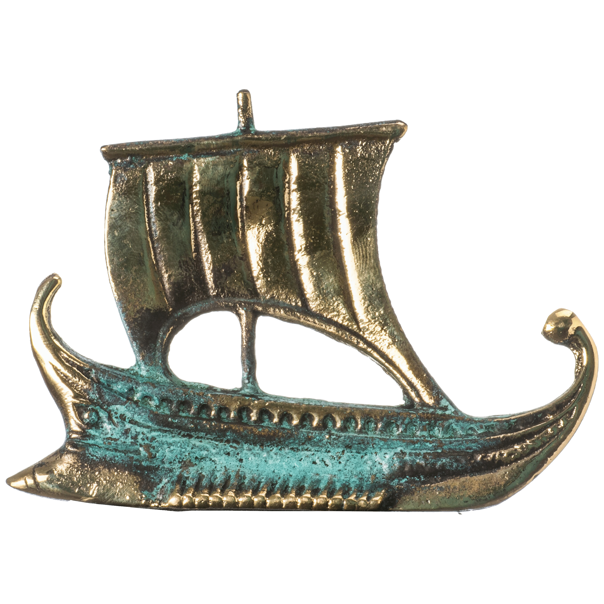

# All Aboard th Argos!

This repo is my solution to a dev challenge to prepare my tech interview with Claire Daudignon from [Wild Code School](https://www.wildcodeschool.com/en-GB)

## The stack

-   I chose a [Next.js](https://nextjs.org/) project bootstrapped with [`create-next-app`](https://github.com/vercel/next.js/tree/canary/packages/create-next-app).
    I have been working with this framework for while now... I ♥️ it !!
-   The database will be [MongoDB](https://www.mongodb.com/). Pour me faciliter l'interface entre le backend et la base de données, j'utilise [mongoose](https://mongoosejs.com/)

## Bon vent !!

[image source](https://www.etsy.com/listing/749178057/ship-argo-of-jason-argonauts-solid)
